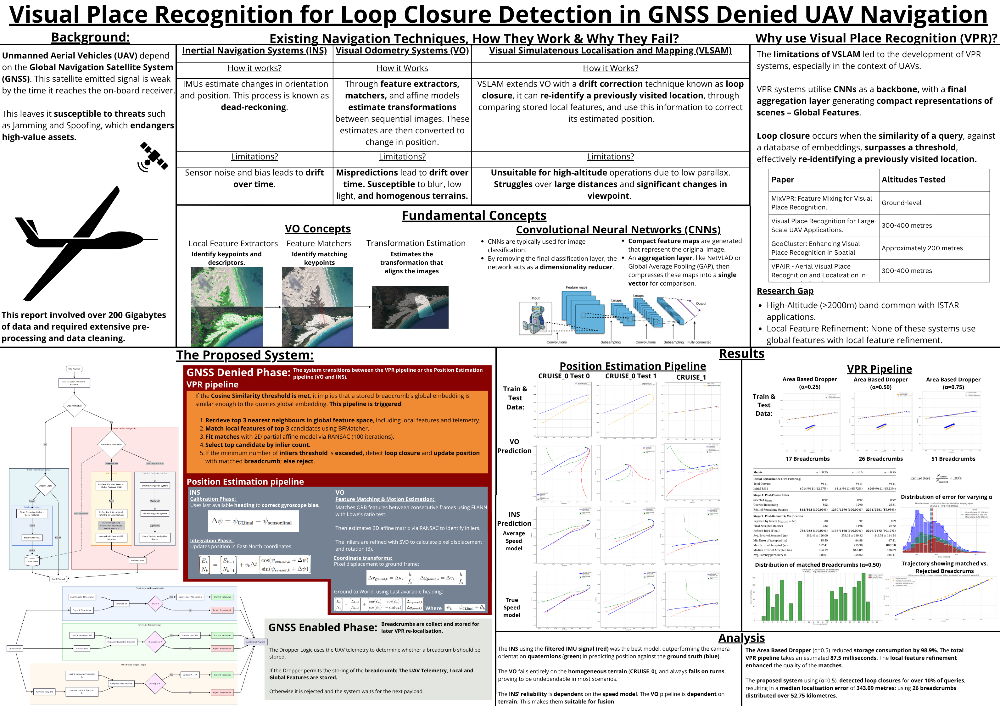

How do you navigate a UAV when someone jams your GPS? This project tackles that problem by building a lightweight Visual Place Recognition (VPR) system that lets a drone figure out where it is by matching what it *currently sees* against a database of geo-tagged images it captured earlier — no satellites required.

The system uses CNN embeddings (MobileNetV3/ResNet18) with FAISS for fast similarity search, ORB features for geometric verification, and a custom "breadcrumb" dropping strategy that cuts storage by ~99% while maintaining full coverage. The whole VPR pipeline runs in **~87ms on a CPU** — comfortably real-time.

Built using real flight data from a Milkor UCAV 380 (fixed-wing MALE UAV) with wing-mounted GoPro HERO11 cameras flying at altitudes up to 2180m.

**William Morley** — Stellenbosch University, BEng Electrical & Electronic Engineering (2025)  
**Supervisor:** Prof. Rensu P. Theart

---

## Report

The full write-up covering data preprocessing, system design, and all experimental results:

📥 [`Report.pdf`](Report.pdf)

---

## Video

https://github.com/Mr-Morley/uav-navigation/raw/main/24868485_Morley_WK_video2025.mp4

---

## Poster



---

## Code Status — Work in Progress

Heads up: my laptop died in the months leading up to submission, which made the final stretch... interesting. The results in the report are all legit and were fully validated before I handed it in, but the codebase here is still being rebuilt and reorganised.

The main things I'm sorting out:
- **Colab → repo migration:** A lot of the heavy experimentation was done on Google Colab with large datasets. Getting all of that cleanly integrated here is ongoing.
- **Reproducibility:** Working on making sure someone can clone this and actually run things end-to-end without needing my exact setup.

The `notebooks/` folder has the data cleaning and preprocessing work. The full src structure (feature extraction, navigation pipelines, VPR) is being restored.

If you have questions about the methodology or results in the meantime, the report is the source of truth.

---

## Repo Structure

```
notebooks/                          — Data cleaning, PSD analysis, preprocessing
24868485_Morley_WK_video2025.mp4    — Project video
Poster.png                          — Project poster
Report.pdf                          — Full report
image_f2_1.png, image_f2_2.png      — Flight 2 sample imagery
```

**Coming soon:**
```
src/feature_extraction/   — CNN extractors (GAP/NetVLAD)
src/navigation/DR/        — Dead-reckoning INS
src/navigation/VO/        — Visual Odometry
src/navigation/VPR/       — Visual Place Recognition pipeline
data/                     — Synchronised Flight 2 dataset
```
